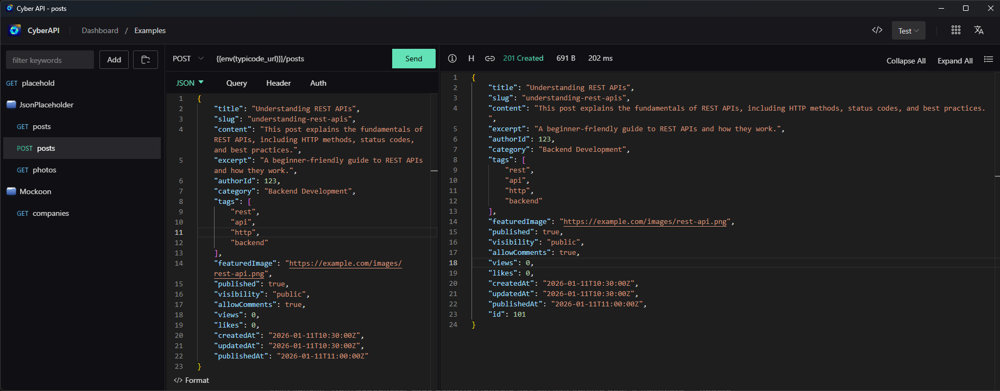

## Cyber API


<p align="center">
    
</p>

<h3 align="center">
<a href="https://github.com/vicanso/cyberapi">CyberAPI</a> 是一个使用 <a href="https://github.com/tauri-apps/tauri">tauri</a> 构建的跨平台 API 客户端。
</h3>

> 中文 | [English](./README.md) | [Українська](./README_uk.md)

本仓库延续并改进了 https://github.com/vicanso/cyberapi 上的原始项目。

## TL;DR

为想要完全掌控数据的开发者准备的 **简单、轻量、跨平台 API 客户端**。

- Windows / Linux / macOS
- 无需账号、登录或订阅
- 不占内存、不臃肿
- 唯一的数据源——最好是你自己的
- 免费且 **开源**

🔍 **文档：**

- [使用说明](USAGE.md)
<!-- 使用说明和更多文档请见项目 wiki：../../wiki -->

## 用法

- 创建并配置 HTTP 请求（方法、URL、请求头、请求体）
- 发送请求并查看响应
- 将请求组织到集合中
- 将数据保存在本地或你自己的存储后端

---

## 为什么会有这个项目

我想要一个 **简单、轻量的工具**，在我工作的每台机器上都能用——**Windows、Linux 和 macOS**——专注于一个明确的目标：

> 以平静、可预期、完全可控的方式处理 HTTP 请求。

我不想在设备之间来回切换时不断 **导入和导出集合**。我想要 **一个属于自己的数据源**，由我拥有，而不是锁在某个服务里。

同样重要的，是我想要避免的东西。

没有 **动辄占用数百 MB 内存** 的应用。  
没有强制 **注册或登录**。  
没有试图取代 IDE、浏览器和操作系统的「瑞士军刀」，而其中大部分功能我根本用不上。

## 起源

在寻找替代方案时，我发现了 **Tauri**，以及一个已经符合我需求核心想法的仓库：  
一个开销极小的 **原生跨平台应用**。

那个仓库已不再维护，但这个想法值得继续下去。

我把它当成 **基础**——在不丢失原有简洁性的前提下，进行现代化和改进。

## 原则

项目坚持几个简单的原则：

- **始终免费且开源**
- 数据 **属于你**
- 不强制账号或外部服务
- 简洁与性能优先于功能清单

## 邀请

这个项目不是要做最大的 API 工具。

而是要做一个 **刻意保持小而可靠的工具**。

如果你对此有共鸣，欢迎查看代码、提 issue 或贡献。

目标是保持简单、轻量、专注。  
细节见 [CONTRIBUTING.md](./CONTRIBUTING.md)。

## 功能

- 支持 macOS、Windows、Linux；安装包小于 10MB
- 单个包含上千接口的项目也能秒开且占用内存低
- 支持深浅色主题和中英文
- 操作与配置简单易用
- 快速从 Postman、Insomnia 或 Swagger 导入配置
- 关键字过滤支持中文拼音或首字母
- 可按接口、功能或项目导出配置，便于团队共享
- 支持多种自定义函数，用于请求之间的联动

<p align="center">
    
</p>

CyberAPI 目前仍是开发版，是利用业余时间维护的个人项目。如果你发现 Bug 或需要新功能，请提交 issue。反馈 Bug 时请附上系统版本信息；我会尽力抽时间处理。

## 安装

安装包可从 [release](https://github.com/vicanso/cyberapi/releases) 下载，提供 Windows、macOS、Linux 版本。

注意：如果你使用 Windows 7，或 Windows 上未安装 Edge，安装器会提示运行 MicrosoftEdgeUpdateSetup。如被杀毒软件拦截，请选择允许。  
如果你使用 macOS，由于系统安全限制，首次打开可能提示 “CyberAPI can't be opened because Apple cannot check it for malicious software.”。前往「系统设置」->「隐私与安全性」->「通用」，选择「仍要打开」。或运行：`sudo xattr -rd com.apple.quarantine /Applications/CyberAPI.app`

## 开发

项目依赖 Rust 与 Nodejs。如果你想自行构建或参与开发，先根据 [这篇指南](https://tauri.app/v1/guides/getting-started/prerequisites) 安装 tauri 依赖，然后运行：

安装 tauri-cli（可选）：

```shell
cargo install tauri-cli
```

以应用形式运行：

```shell
npm run tauri dev
```

构建安装包：

```shell
npm run tauri build
```
