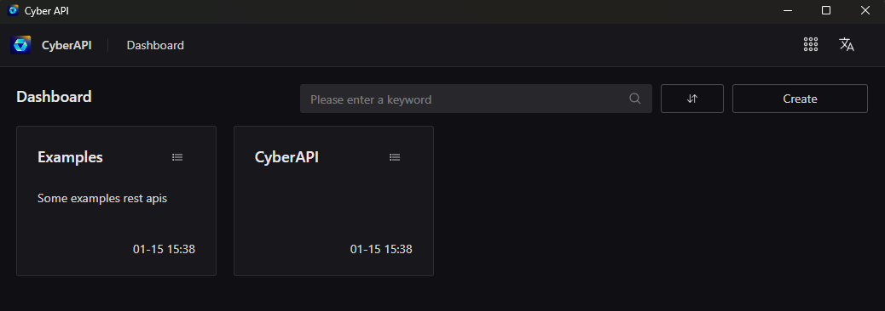
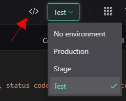
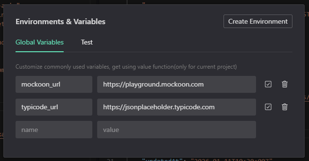
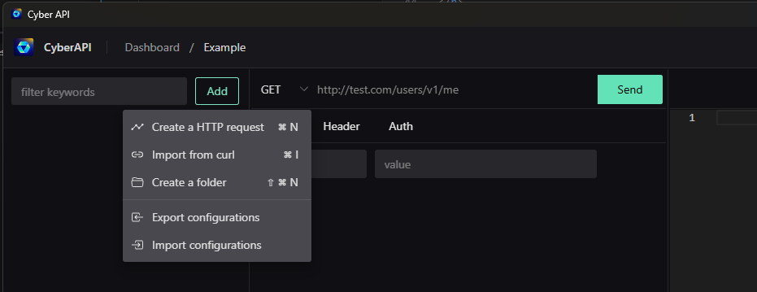
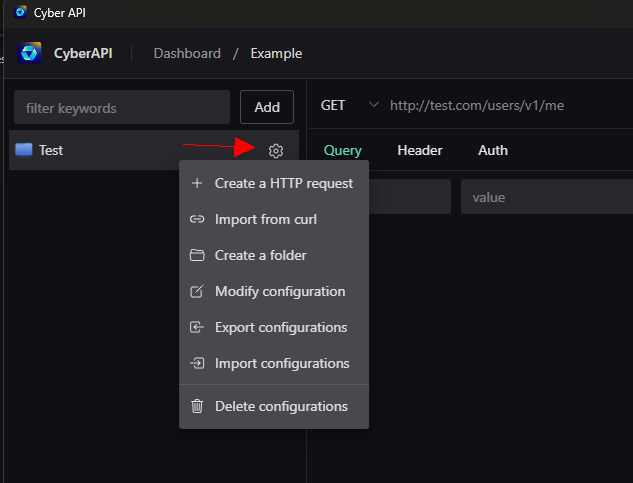
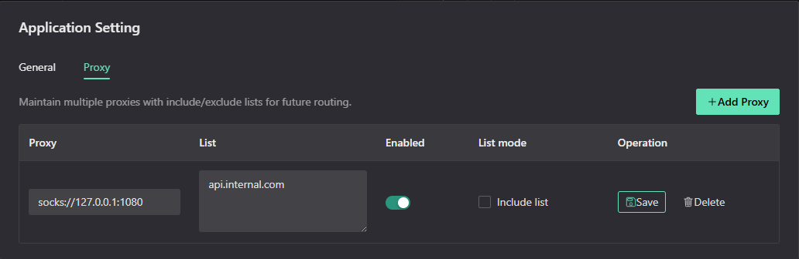

## Create a project

After the first launch, you need to create a project. It is recommended to create projects separately; a single project can share environment variable configuration.

    

## Environments & Variables

Environments let you store values that can change between setups — such as API base URLs, tokens, or other configuration settings.

You can define:

- **Global variables** — available across the entire project  
- **Environment variables** — specific to a single environment (e.g. Dev, Test, Prod)

**Environment variables have higher priority than global variables** and will override them when both are defined.

This makes it easy to switch between environments without modifying requests, keeps your project organized, and helps prevent configuration mistakes. Variables can be referenced in request parameters via the `{{env(key)}}` function.

    

    

## Create folders and requests

Before creating requests, it is recommended to create groups by feature, for example a user-related group:

    

After creating a group, you can create the corresponding requests under it:

    

After creating a request, you can select the env used by the request (automatically added to the request URL), choose the HTTP Method, and enter the URL. For POST requests, you can choose the data type for the body. For example, if you select JSON, fill in the parameters. The `{{md5(123123)}}` in the image is a function form; it is executed when the request is sent to fill in the data. These functions are introduced later:

    

After configuration, click Send to send the request. The response is shown as below. Clicking the first icon shows the request ID (used later when other requests need to reference this response). Clicking the second icon shows the corresponding `curl`.

    

### Different data types

The most common submission types are JSON and Form. The example below shows filling Form data (note that switching data types clears existing data). If you temporarily don't want to use a parameter, just uncheck it. Unneeded parameters can be deleted. Parameters can also use function form:

    

`Query` and `Header` settings are similar to `Form`, so they are not detailed here.

## Proxy routing

You can configure multiple proxies in **Settings → Proxy**. Each proxy supports `http://` and `socks5://` addresses (for example `socks5://127.0.0.1:1080`). Use the include/exclude toggle to decide whether the list is a whitelist (include) or blacklist (exclude). Put one host per line in the list (e.g. `api.example.com` or `.example.com` for all subdomains). Leave the list empty to apply the proxy to all hosts. Enable the proxy to make it active; the first active matching proxy is used for requests.

    

## Pin

For frequently used requests, you can pin them to the top via `Pin` for easier access. The operation is shown below:

    

## Built-in functions

CyberAPI includes some built-in functions to generate parameter values dynamically in requests. The functions are:

- `readTextFile`: read a text file, shorthand `rtf`
- `readFile`: read a file, shorthand `rf`
- `base64`: convert to base64, shorthand `b64`
- `openFile`: open a file; prompts the user to select a file, shorthand `of`
- `get`: get a value from a request response, shorthand `g`
- `timestamp`: timestamp (seconds), shorthand `ts`
- `md5`: md5 output in hex
- `sha256`: sha256 output in hex
- `random`: generate example data such as random emails or names

### readTextFile

Reads a file and returns it as a string. Parameters: `(file, dir)`, where `dir` is optional and defaults to `Download`. For security, only three directories are allowed: `document`, `desktop`, and `download`. For example, to read `test/data.json` under `download`, use: `{{readTextFile(test/data.json, download)}}`

### readFile

Reads a file and returns bytes. Parameters and usage are the same as `readTextFile`, only the return type is different.

### base64

Converts bytes to base64. This is commonly used when chaining functions, such as reading an image and converting it to base64. Usage: `{{base64.readFile(test-files/data.jpg, document)}}`, which reads the image and converts its data to base64. Function chaining can combine multiple functions. Processing is right-to-left, where the argument of the later function is the return value of the previous function.

### openFile

Opens a file picker dialog for the user to choose a file and returns the selected file path.

### get

Gets the response of a specified request. For example, request A responds with `{"data": {"name": "CyberAPI"}}`, and request B needs to use `data.name` from request A. First get request A's ID by clicking the icon in request A's response, as shown below:

    

After obtaining request A's ID (it doesn't change), use: `{{get(01GCE5X1X5FXM3D13NQQKYEWF7, data.name)}}`. This is mainly used when one API depends on another API's response.

Note: If response data `data` is an array, use `data.0.name` to get the first element.

### timestamp

Timestamp (seconds), used to return the current time. Usage: `{{timestamp()}}`

### md5/sha256

Calculates md5 and outputs in hex. Usage: `{{md5(123123)}}`. The usage of sha256 is the same.

### env

Gets values from the global configuration. Usage: `{{env(key)}}`, which makes it easy to access variable data configured in the project.

### random

Generates quick example strings. Usage: `{{random(email, gmail.com)}}` yields a random email using the provided domain; `{{random(name)}}` returns a random name, `{{random(name, bot)}}` prefixes the name with `bot-` and `{{random(20)}}` returns a random string of 20 characters in length (default = 10).

## Cookie settings

Cookie data is shared across the application. If the HTTP response headers contain `Set-Cookie`, it is saved automatically. Note that cookies with `Session` expiration are cleared after the app is closed. Users can directly modify cookie expiration and values, or delete cookies.

    

## Configuration import

Configuration import supports four methods. `JSON` and `File` only support importing the `CyberAPI` configuration format. `PostMan` is for importing Postman configurations, and `Insonmia` is for importing Insomnia configurations.

    

    

